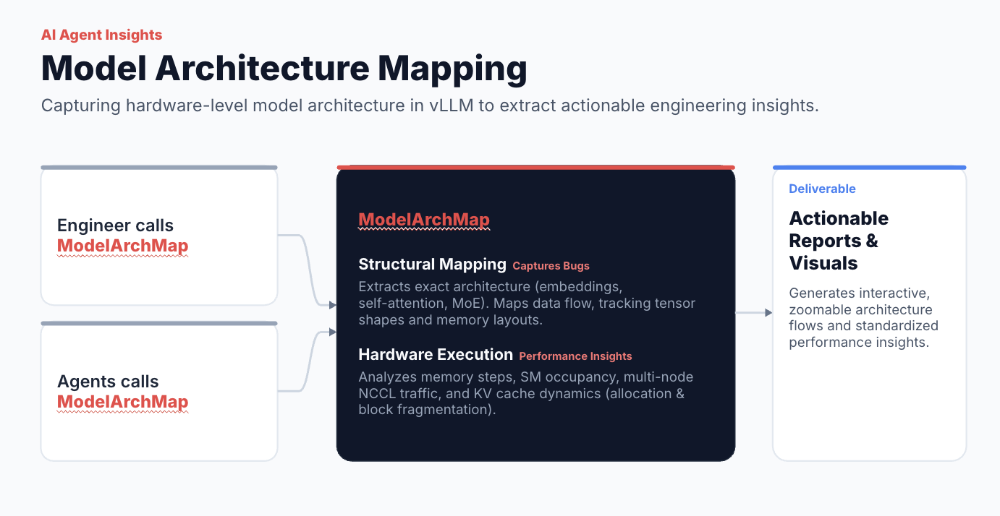
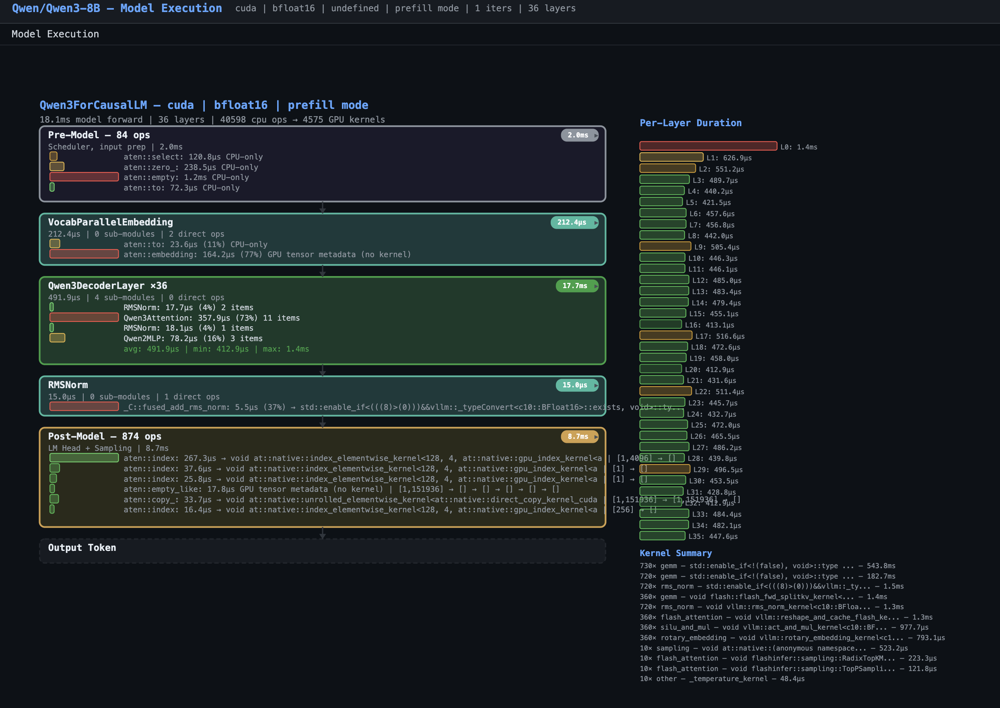
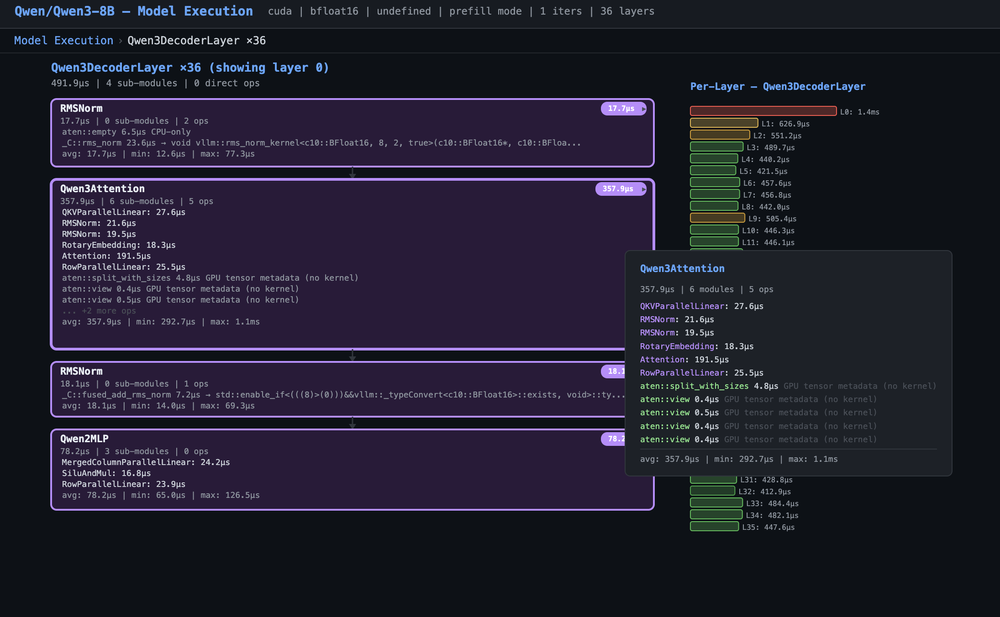
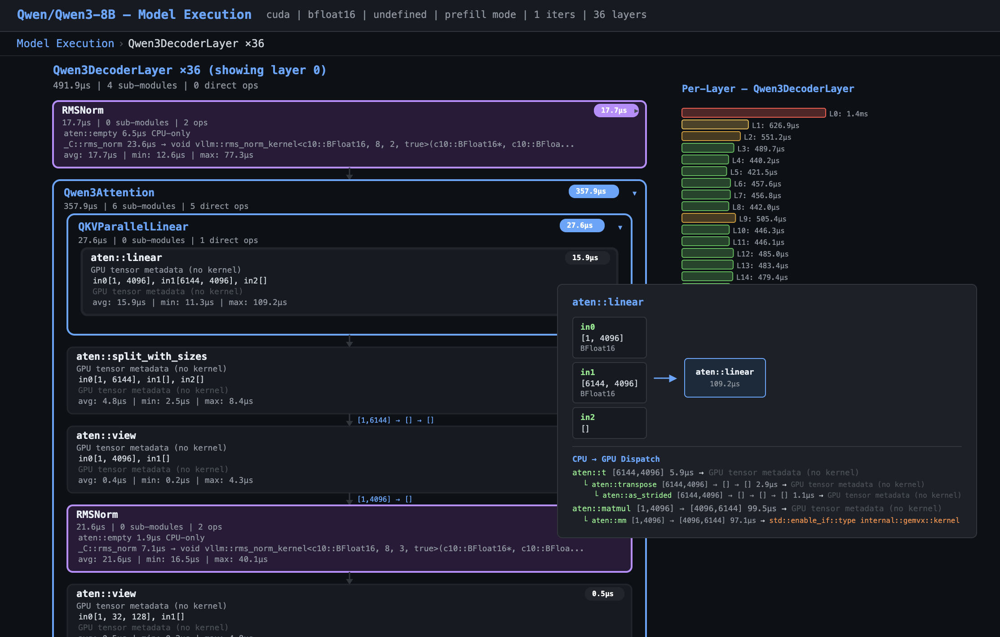

# Hardware-Aware Model Architecture & Execution Mapper for vLLM

> **Status: Initial Alpha / Verification Phase**  
> This is an initial prototype of an automated model profiling framework. The pipeline successfully executes end-to-end on **Qwen3-8B (DGX SPARK)** and generates full graph artifacts.

## Overview

Manually mapping a model’s structural architecture to the underlying hardware execution paths in vLLM is complex and time-consuming.

This automated, hardware-aware framework dynamically analyzes model topologies and low-level runtime data to map model architectures directly onto optimized vLLM execution paths.

## Key Capabilities

* **Structural Mapping**: Extracts exact model architectures (embeddings, self-attention blocks, MoE routers) and tracks tensor data flow, memory layouts, and layer connections to **catch structural bugs**.
* **Hardware Execution Tracing**: Provides step-by-step insight into memory, SM occupancy, multi-node NCCL traffic, and KV cache dynamics (allocation efficiency, block fragmentation, and capacity limits) to **diagnose performance bottlenecks**.

## Architecture Preview



## Roadmap

* [x] Extracted model architecture trees (`walk_model.py` → `model_tree.json`). with optional --forward flag.
* [x] Captured vLLM forward pass execution hooks (`capture.py` → `flow.json`).
* [x] Collected low-level PyTorch profiler traces (`.pt.trace.json.gz`).
* [x] Built graph mapper to correlate trace data (`build_graph.py` → `model_graph.json` & `execution_flow.json`).
* [x] Created interactive D3.js dashboard (`model_viz.html` with `vTop`, `vLayer`, `vStep`, and `flowTip()`).
* [ ] Model Generalization: Refactor entry points to support any vLLM model architecture.
* [ ] Verification Test Suite: Add unit tests to assert node/edge counts and verify parent-child kernel linkage automatically.
* [ ] Preserve Metadata Ops: Update build_gpu_chain() in build_graph.py to keep metadata/layout ops (aten::view, aten::reshape).
* [ ] Tensor Metadata Enrichment: Capture explicit memory strides, layout formats (column-major vs. row-major), and precision types (fp16, bf16, fp8).
* [ ] NSYS Data Parsing: Build a parser for exported NSYS SQLite databases (.sqlite) to integrate low-level CUDA driver API events and OS runtime context.
* [ ] NCU Kernel Profiling: Parse NVIDIA Nsight Compute metric exports (SM occupancy, memory bandwidth, block fragmentation).
* [ ] Full Model Diagram: Expand model_viz.html to generate full end-to-end model dependency graphs.
* [ ] **Fusion Mapping & Visual Overlay**: Render piecewise fusion boundaries in `model_viz.html` (e.g., grouping eager sub-nodes into fused piecewise blocks or highlighting candidate clusters).
* [ ] **Optimization Recommender for Agents & Engineers**: Generate automated candidate reports (e.g., *"Layer 12 RMSNorm candidate for CUDA fusion"*) to feed directly into agents or guide manual engineering workflows.

### Future Scope (Long Term): Multi-Node & Distributed Scaling Support

* [ ] Tensor Parallelism (TP).
* [ ] Pipeline Parallelism (PP).
* [ ] Data Parallelism (DP).
* [ ] Prefill/Decode (P/D) Disaggregation.
* [ ] Wide Expert Parallelism (EP).

## Framework Architecture & Pipeline Breakdown

### Stage 1: Capture (runs on GPU server)

```text
  ┌────────────────────────────┬─────────────────────────────────────────────────────────────────────┐
  │            File            │                            What it does                             │
  ├────────────────────────────┼─────────────────────────────────────────────────────────────────────┤
  │ capture.py +               │ Hooks into vLLM's forward pass, captures op traces → flow.json      │
  │ flow_support.py            │                                                                     │
  ├────────────────────────────┼─────────────────────────────────────────────────────────────────────┤
  │ walk_model.py              │ Walks the model's nn.Module tree, dumps weights/shapes →            │
  │                            │ model_tree.json                                                     │
  ├────────────────────────────┼─────────────────────────────────────────────────────────────────────┤
  │ vLLM's built-in profiler   │ PyTorch profiler trace → profiles/rank0.*.pt.trace.json.gz          │
  └────────────────────────────┴─────────────────────────────────────────────────────────────────────┘
```

### Stage 2: Build (runs locally)

```text
  ┌────────────────┬─────────────────────────────────────────────────────────────────────┐
  │      File      │                            What it does                             │
  ├────────────────┼─────────────────────────────────────────────────────────────────────┤
  │ build_graph.py │ Reads all 3 inputs, produces model_graph.json + execution_flow.json │
  └────────────────┴─────────────────────────────────────────────────────────────────────┘
```

  Key functions in build_graph.py:

* build_model_graph() — merges model_tree.json + flow.json → model structure with nodes/edges/config
* build_gpu_chain() — the big one. Reads the PyTorch trace, builds the full execution chain:
    a. Filters CPU ops (removes metadata ops like aten::view, aten::reshape) <--- todo:don't filter it>
    b. Maps each CPU op's Input Dims → named args via OP_ARGS signatures
    c. Correlates CPU ops → GPU kernels via ac2g flow events
    d. Detects layer boundaries (silu_and_mul → fused_add_rms_norm pattern)
    e. Builds template (average across layers), per-layer data, pre/post layers
* _named_args() — maps positional dims to named parameters from OP_ARGS
* _compute_output() — infers output shape from op type + input dims
* classify_gpu_role() / clean_kernel_name() — GPU kernel classification

### Stage 3: Visualize

```text
  ┌────────────────┬────────────────────────────────────────────────────────────────────────┐
  │      File      │                              What it does                              │
  ├────────────────┼────────────────────────────────────────────────────────────────────────┤
  │ model_viz.html │ D3.js single-page app. Loads both JSON files, renders interactive flow │
  └────────────────┴────────────────────────────────────────────────────────────────────────┘
```

  Views: vTop (pipeline overview) → vLayer (per-layer ops) → vStep (per-layer variance). Hover shows
  flowTip() diagram.

## Repository Directory Structure

```text
vllm_arch_map/
├── README.md                   
├── walk_model.py
├── flow_support.py
├── profiler_to_diagram
├── model_viz.html
│
├── images/
│   ├── ModelArchAgent.png
│   ├── qwen3_1.png
│   ├── qwen3_2.png
│   └── qwen3_3.png
│
└── [Sample Artifacts & Profiles]  # Reference data & profiles 
    ├── profiles/                 # Captured PyTorch traces (.pt.trace.json)
    ├── qwen3_serve_trace.*       # Raw NSYS profile traces (.nsys-rep, .sqlite)
    ├── model_tree.json
    └── model_execution.json
```

## Quickstart Guide

### Step 1: Serve Model with Profiling Enabled

Run vLLM on your GPU server with eager mode and profiler flags enabled:

```bash
  vllm serve Qwen/Qwen3-8B \
      --enforce-eager \
      --profiler-config.profiler=torch \
      --profiler-config.torch_profiler_dir=./profiles \
      --profiler-config.torch_profiler_record_shapes=true \
      --profiler-config.torch_profiler_with_stack=true \
      --enable-layerwise-nvtx-tracing \
      2>&1 | tee logs.txt
```

### Step 2: Capture a trace

```bash
  curl -X POST localhost:8000/start_profile
  curl -H "Content-Type: application/json" localhost:8000/v1/chat/completions \
    -d '{"model":"Qwen/Qwen3-8B","messages":[{"role":"user","content":"hello"}]}'
  curl -X POST localhost:8000/stop_profile
  Produces: profiles/rank0.*.pt.trace.json.gz
```

### Step 3: Extract model tree (on GPU )

```bash
 VLLM_ALLOW_INSECURE_SERIALIZATION=1 python walk_model.py Qwen/Qwen3-8B -o model_tree.json --with-forward
 #Produces: model_tree.json
```

### Step 4: Build flow.json (merges logs + trace + model tree)

```bash
  python3 profiler_to_diagram.py #Produces: model_execution.json
```


### Step 6: View

```bash
  python3 -m http.server 8765
  open http://localhost:8765/model_viz.html
```

  Tested on DGX SPARK +  Qwen/Qwen3-8B
  on baremetal+ building within virtual env.

### Step 7: Capture NSYS trace (Integration planned for future release)

```bash
nsys profile     --trace-fork-before-exec=true     --cuda-graph-trace=node     -t cuda,nvtx,osrt     -w true     -o qwen3_serve_trace     vllm serve Qwen/Qwen3-8B   --enforce-eager     --enable-layerwise-nvtx-tracing     2>&1 | tee logs.txt
```

> **Note:** This reflects the current state of the visualizer interface.

Currently it looks like this (you can also view and interact with it directly in `model_viz.html`):

View of the model:


Zoom in to the decoder layer:


Zoom in to the _C::rms_norm:

